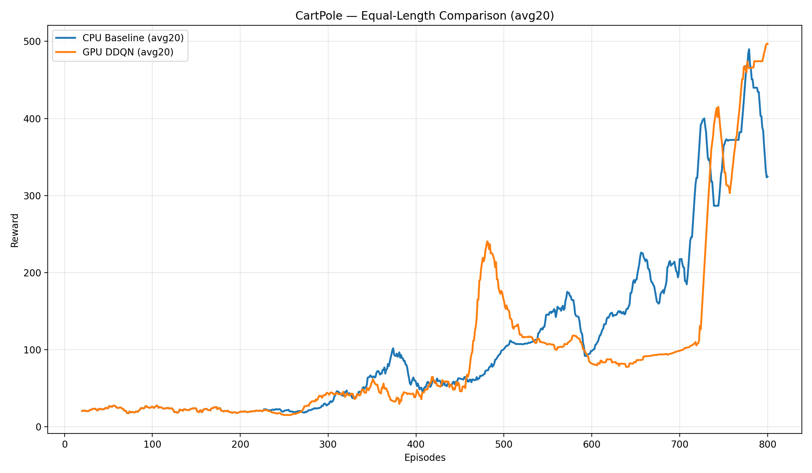
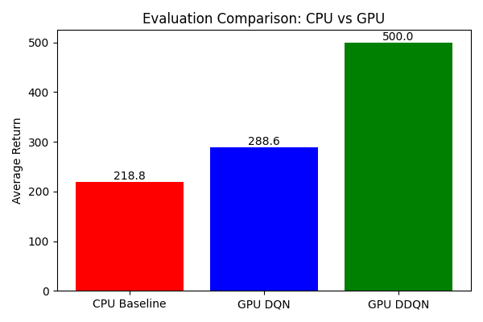
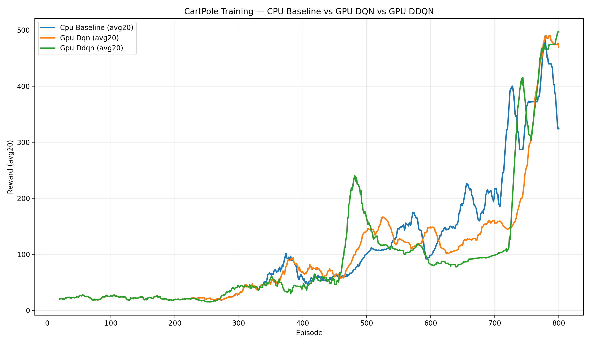
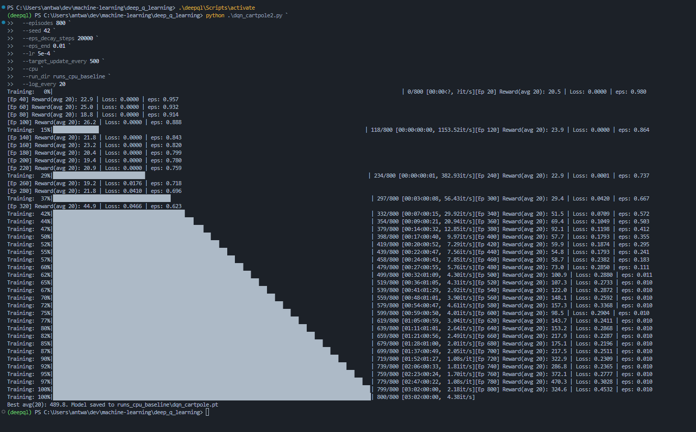
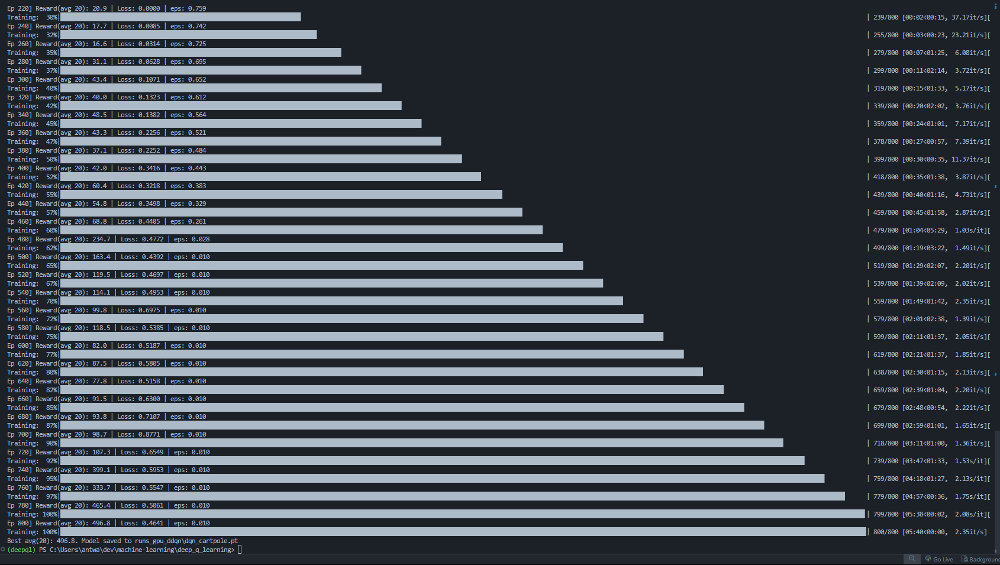
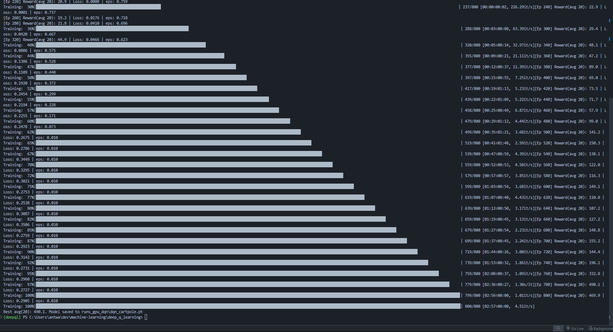

# CartPole: Deep Q-Learning vs Double DQN on CPU and GPU

**Authors:**  
Antwain M. Sparks and Vojislav Stojkovic  
Morgan State University, Computer Science Department, Baltimore, MD 21251

---

## Abstract

Reinforcement learning (RL) enables agents to learn decision-making by interacting with an environment. Q-Learning (QL) is a foundational RL algorithm for assigning values to state–action pairs, requiring no environment model. Deep Q-Learning (DQL) extends QL with deep neural networks to handle larger state spaces.

The CartPole environment is a classic RL benchmark. This project compares RL algorithm performance using CartPole under three main configurations:
- **CPU-based Deep Q-Network (DQN) baseline**
- **GPU-accelerated DQN**
- **GPU-accelerated Double DQN (DDQN)**

While GPU acceleration improves training speed, stability and convergence are achieved only with algorithmic improvements like DDQN. The combined approach (GPU + DDQN) consistently solves CartPole at the maximum reward.

---

## Demo Video

**Symposium Demo:**  
[Download or view symposium_comparison_side_by_side.mp4](./symposium_comparison_side_by_side.mp4)

---

## Methodology

- **CartPole Environment:** Standard OpenAI Gym setup.
- **Algorithms:** DQN and DDQN (target network decouples selection and evaluation).
- **CPU vs GPU:** Compared execution speed and stability.
- **Training Setup:**
  - Episodes: 800
  - Epsilon decay: to 0.01
  - Replay buffer: 100,000
  - Batch size: 64
  - Learning rate: 5e-4

---

## Results (Summary Table)

| Model         | Device | Episodes to Solve | Final Avg Reward | Training Time (mins) |
|---------------|--------|-------------------|------------------|----------------------|
| DQN (CPU)     | CPU    | >600 (unstable)   | ~183             | ~8.5                 |
| DQN (GPU)     | GPU    | 800 (not solved)  | 288.6            | ~7                   |
| DDQN (GPU)    | GPU    | ~480 (solved)     | 500.0            | ~8.5                 |

---

## Charts

---

## Figures (Screenshots & Extras)

---

## Technical Specs

- **CPU:** Intel i7-12700H (20 cores)
- **RAM:** 16 GB
- **GPU:** NVIDIA GeForce RTX 3050 Ti Laptop GPU (4 GB VRAM)
- **CUDA:** 12.4
- **Python:** 3.11.9
- **PyTorch:** 2.6.0+cu124

---

## Key Takeaways

- **CPU DQN:** Slow, unstable, fails to solve CartPole.
- **GPU DQN:** Faster, but does not converge reliably.
- **GPU DDQN:** Consistently solves CartPole (avg return 500).
- **Lesson:** Algorithmic improvements (DDQN) + GPU acceleration deliver best results.

---

## Conclusion

GPU acceleration helps, but refining the algorithm (DDQN vs DQN) is essential to reliably solve CartPole. The DDQN + GPU combination provides the strongest performance.

---

## How to Reproduce

1. Clone this repo and install requirements (`pip install -r requirements.txt`)
2. Run training scripts for CPU/GPU DQN and DDQN
3. Generate analysis charts and figures using included scripts (`comparison.py`, `eval_to_chart.py`, etc.)

---

**For full implementation details and code, see the repository:**  
https://github.com/AntwainSparks/deep_q_learning
**Demonstration video of training results:**
https://youtu.be/8YI0he9-Usc
